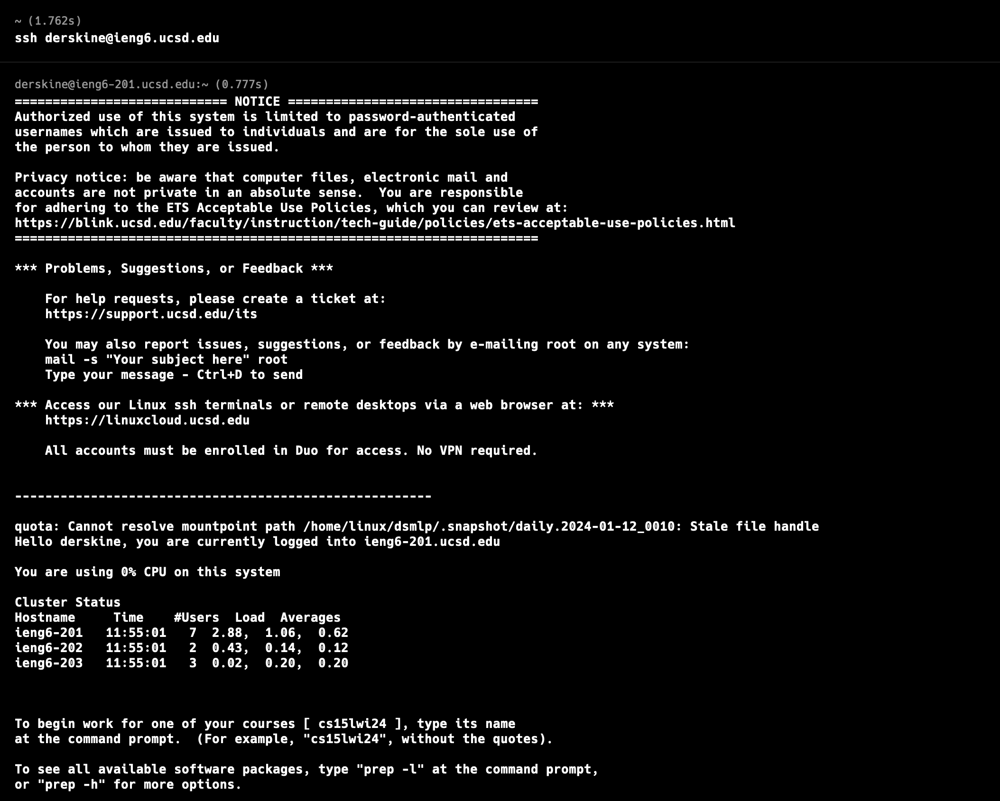

## CSE 15L Lab Report 2
### Part 1
#### ChatServer Code:
```
import java.io.BufferedWriter;
import java.io.FileWriter;
import java.io.IOException;
import java.io.PrintWriter;
import java.net.URI;
import java.nio.file.Files;
import java.nio.file.Paths;
import java.util.List;

class Handler implements URLHandler {
  List<String> lines;
  String messageHistory = "";

  public String handleRequest(URI url) {
    String query = url.getQuery();
    String message = "";
    String user = "";
    String helperMessage = query.split("&")[0];
    String helperUser = query.split("&")[1];
    if(url.getPath().equals("/add-message")) {
      if(helperMessage.startsWith("s=")) {
        message = helperMessage.split("=")[1];
      }
      if(helperUser.startsWith("user=")) {
        user = helperUser.split("=")[1];
      }
      messageHistory += String.format("%s: %s \n", user, message);
      return messageHistory;
    } 
    return "";
  }
  void log(String s) {
    try(FileWriter fw = new FileWriter("session.log", true);
        BufferedWriter bw = new BufferedWriter(fw);
        PrintWriter out = new PrintWriter(bw)) {
        out.println(s);
    } catch (IOException e) {
        //exception handling left as an exercise for the reader
    }
  }
}

class ChatServer {
  public static void main(String[] args) throws IOException {
    if(args.length == 0){
      System.out.println("Missing both port number and file path! For the first argument (port number), try any number between 1024 to 49151. For the second argument (file path), give a path to a text file.");
      return;
    }

    int port = Integer.parseInt(args[0]);

    Server.start(port, new Handler());
  }
}
```

#### Screenshot 1:

* The only method that runs is `handleRequest()`. The only other method in my code is the `main()` method which only runs when starting the server. `handleRequest()` runs each time you add a chat.
* The only relevant argument in `handleRequest()` is `URI url`, which is `/add-message?s=yoooo&user=john`. `messageHistory` is equal to the entire chat history. There are other relevant fields to this method, but no others ones for this class.
* `"john: yoooo"` was added to `messageHistory` with this specific request and is the only class field that is changed with this specific request.

#### Screenshot 2:

* Again, the only method that runs is `handleRequest()`. The only other method in my code is the `main()` method which only runs when starting the server. `handleRequest()` runs each time you add a chat.
* The only relevant argument in `handleRequest()` is `URI url`, which is `/add-message?s=straight chillin&user=beth`. `messageHistory` is equal to the entire chat history. There are other relevant fields to this method, but no others ones for this class.
* `"beth: straight chillin"` was added to `messageHistory` with this specific request and is the only class field that is changed with this specific request.

### Part 2
* Absolute path to the Private Key for your SSH key for logging into `ieng6` on my Computer


* Absolute path to the Public Key for your SSH key for logging into `ieng6` on `ieng6`'s File System


* Terminal Interaction where I logged in without being asked for a Password


### Part 3

Something I did not know anything about before lab in weeks 2 and 3 was how to log into and use my `ieng6` account. This is the first class or project that has involved me logging into and using another computer remotely. I have used Google Colab in the past, which from what I understand is very similar to using my `ieng6` account but I am using a Google computer and not a UCSD computer. I find this all very interesting and look forward to seeing how we use `ieng6` in the future!
