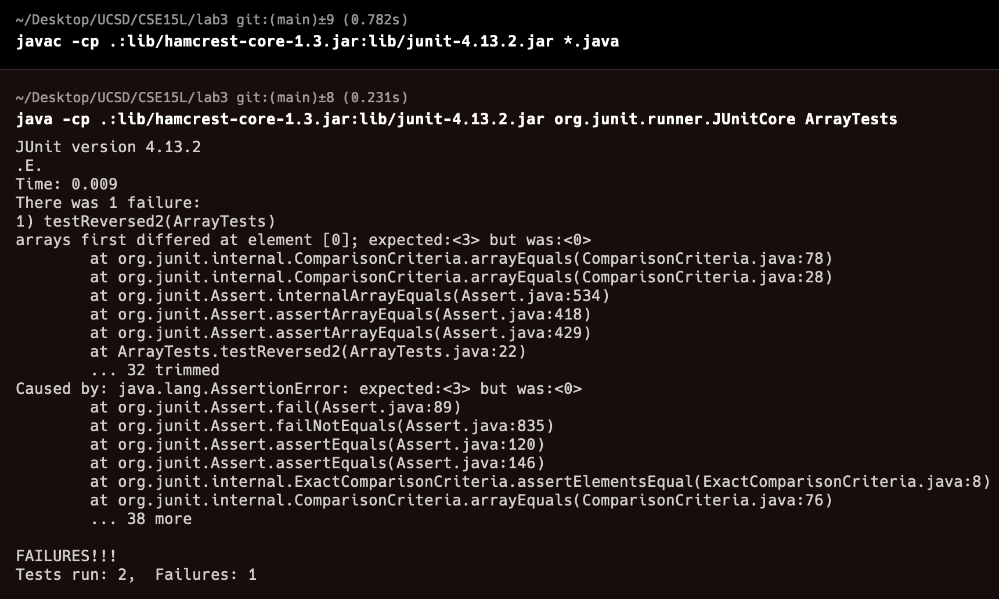

## CSE 15L Lab Report 3
### Part 1 - Bugs:
#### Failure-Inducing Input Example:
```
@Test
public void testReversed2() {
  int[] input1 = { 1, 2, 3 };
  assertArrayEquals(new int[]{ 3, 2, 1 }, ArrayExamples.reversed(input1));
}
```

#### Input that doesn't Induce a Failure:
```
@Test
public void testReversed3() {
  int[] input1 = { 0 };
  assertArrayEquals(new int[]{ 0 }, ArrayExamples.reversed(input1));
}
```

#### The Symptom:


#### The Bug: 
```
static int[] reversed(int[] arr) {
  int[] newArray = new int[arr.length];
  for(int i = 0; i < arr.length; i += 1) {
    arr[i] = newArray[arr.length - i - 1];
  }
  return arr;
}
```
```
static int[] reversed(int[] arr) {
  int[] newArray = new int[arr.length];
  for(int i = 0; i < arr.length; i += 1) {
    newArray[i] = arr[arr.length - i - 1];
  }
  return newArray;
}
```
##### Brief Description:
This change fixes the method `reversed()` because the original method sets `arr[i]` equal to newArray[arr.length - i - 1] but `newArray` 
is an empty array that is the same length as `arr`. The new method instead sets `newArray[i]` equal to `arr[arr.length - i - 1]`. Then,
I returned `newArray` instead of `arr` since that is the correct reversed array.

### Part 2 - Researching Commands:
#### 'grep -r "Search String" <path to directory>'
```
grep -r "biofilm formation" technical/biomed
technical/biomed/1471-2180-2-7.txt:        biofilm formation.
technical/biomed/1471-2180-2-7.txt:          biofilm formation. Figure 1aand 1bshow that striking
technical/biomed/1471-2180-2-7.txt:          Conditions for biofilm formation
technical/biomed/1471-2180-2-7.txt:          result in increased biofilm formation, eight strains
technical/biomed/1471-2180-2-7.txt:          biofilm formation for any of the strains.
technical/biomed/1471-2180-2-7.txt:          To characterize the kinetics of biofilm formation, the
technical/biomed/1471-2180-2-7.txt:          level of biofilm formation was measured at selected time
technical/biomed/1471-2180-2-7.txt:          biofilm formation shows a leveling off and the optical
technical/biomed/1471-2180-2-7.txt:          Role of pili in biofilm formation
technical/biomed/1471-2180-2-7.txt:          expression of pili was tested for biofilm formation along
technical/biomed/1471-2180-2-7.txt:          comparing biofilm formation in 4 duplicate wells, strain
technical/biomed/1471-2180-2-7.txt:          biofilm formation compared to its isogenic parent strain
technical/biomed/1471-2180-2-7.txt:        The assay for biofilm formation used in this study is
technical/biomed/1471-2180-2-7.txt:        biofilm formation by a variety of other gram-positive and
technical/biomed/1471-2180-2-7.txt:        biofilm formation in flow cells, the other widely used
technical/biomed/1471-2180-2-7.txt:        biofilm formation. First, Watnick and Kolter [ 36 ] showed
technical/biomed/1471-2180-2-7.txt:        more definitive answers regarding biofilm formation in
technical/biomed/1471-2180-2-7.txt:        the early stages of biofilm formation [ 36 41 ] .
technical/biomed/1471-2180-2-7.txt:        Pili are important in biofilm formation. As the role of
technical/biomed/1471-2180-2-7.txt:          quantitate biofilm formation, 20 μl of Difco crystal
```
`grep` with `-r` allows `grep` to search through all files in the specified directory and all of its subdirectories. `-r` is useful because you can see which .txt files contain a certain string.

```
grep -r "Theory helps" technical/plos
technical/plos/pmed.0020232.txt:        Theory helps researchers organize facts, identify missing information, design surveillance,
```
This example shows the same functionality as the first example but since only one file had the string `"Theory helps"`, only one file is returned.

#### `grep -v "Search String" <path to text file>`
```
grep -v "a" technical/biomed/1468-6708-3-1.txt


        Introduction
        elderly [ 9 ] .


          Study


          ] .
          (for persons who were never in excellent, very good, or
          report results using only the simpler definition.
          findings.


        Results
        likely.
        from 25 to 29.9. The second column, which shows results
        under 20.
        groups.
        YOL or YHL.


        Discussion


          YHL.


        Conclusion
        'overweight' by the NHLBI guidelines. This suggests using


        Competing interests


        CESD Center for Epidemiologic Studies Depression
        poor?


```
`grep` with `-v` returns all lines that do not have the given search string. This could be useful when you want to exclude certain lines from your output.

```
grep -v "o" technical/biomed/1468-6708-3-4.txt


        Examples

          Example 1


          Example 2


          Example 3
          heart failure [ 3 ] . 'The primary pre-specified analysis
          missing exercise time data at 24 weeks were: 'exercise


          Example 4
          in analyses.'


          Example 5
          study.'


        1.)
        as (a) (24 (cr)+0)/54 = 44.4% and (b) (24 (cr)+24)/54 =
        48/54 = 88.9%.
        that (c) is in-between (a) and (b), and in this case, leans
        summary instead.


        the missing data, we are essentially assuming that the
        stayed within the trial. MCAR certainly is less restrictive
        discussed later.
        • All three estimates given by (a), (b), and (c) are
        derived.


          Objectives
          (until death) in such a design. A recent example is [ 8 ]


          missing data are filled-in (imputed), all the statistical
          analysis.
          (unrealistically) that the missing data after patient's
          variability and that it alters the sample size.
          missing data. The design suggested by Murray and Findlay


        are replaced by the ranks.
        the patients' withdrawal. Still, the main issue is the


        intrinsically difficult because it requires a large
        clinical study less credible. The best available advice is


```
This example shows that when you change the search string and the file you are searching through, you will get a different result with different lines being excluded from your output.

#### `grep -c "Search String" <path to text file>`
```
grep -c "a" technical/biomed/1468-6708-3-1.txt
377
```
`grep` with `-c` counts the number of lines that match the search string. This could be useful when determining the frequency of a certain string in a file without manually having to count the output lines.

```
grep -c "help" technical/biomed/1468-6708-3-1.txt
1
```
This example shows that there is only one line that has the string `"help"` in the given text file, showing that it is infrequently used in this text file.

#### `grep -n "Search String" <path to text file>`
```
grep -n "Analysis" technical/biomed/1468-6708-3-1.txt
149:          Analysis
371:          group were similar. Analysis of mean YOL instead of the
```
`grep` with `-n` returns the line number where the search string is located. `-n` is useful if you need to know the location of a string in a text file, not just if it exist.
```
grep -n "help" technical/biomed/1468-6708-3-1.txt
281:        treatment to help underweight women achieve normal weight
```
This example shows the location of the string `"help"`. As seen, it is on line 281.
