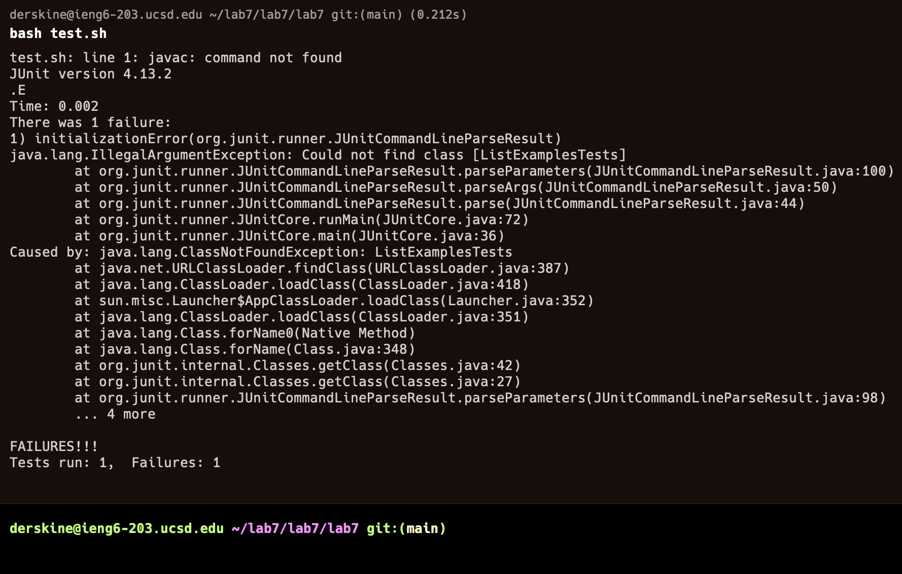

## CSE 15L Lab Report 4
### Part 4
* Keys Pressed: `<up>` `<enter>`.
* The `ssh derskine@ieng6.ucsd.edu` command was one up in the search history so I moved up one to access it.
#### Screenshot 1:

### Part 5
* Keys Pressed: `cd lab7/` `<return>`, `cd lab7/` `<return>`, `git clone ` `<command v>` `<return>`.
* There are multiple layers of `lab7` repositories in my server so I change my working directory to the correct directory. I typed `git clone` then pasted the copied link of the forked github repository.
#### Screenshot 2:

  
### Part 6
* Keys Pressed: `cd lab7/` `<return>`,  `bash test.sh` `<return>`.
* I change my directory to the `lab7` that was created during Part 5. I then run `bash test.sh` to run the test and show that they fail.
#### Screenshot 3:

### Part 7
* Keys Pressed: `vim ListExamples.java` `<return>`, `/test` `<enter>` `<down>` `dd` `/test` `i` `<right>` `<return>` `<delete>` `<delete>` `<delete>` `index2 += 1;`, `:wq` `<return>`.
* I open `ListExamples.java` using vim. I then search for the string `test` and press `<enter>` to change the location of my text editor. I think use `<down>` to get on the correct line and use `dd` to delete all text on this line. I then return to the location of `test`. I then begin to insert and move to the right and `<return>` to move down a line. I then `<delete>` three times to delete one spaces and two slashes. I then insert the string `index2 += 1;` and save my work with `:wq`. I don't believe this is the fastest way to do this but it worked for me and made sense logically.
#### Screenshot 4:

### Part 8
* Keys Pressed: `bash test.sh` `<return>`.
* I ran the bash script using `bash test.sh` to show that the test work.
#### Screenshot 5:

### Part 9
* Keys Pressed: `git add --all` `<return>`, `git commit -m "Fixing"` `<return>` `git push` `<return>`.
* I run `git add --all` and `<return>` to add all changes, then use `git commit -m "Fixing"` and `<return>` to commit all changes and add a message, then use `git push` and `<return>` to push all changes to Github.
#### Screenshot 6:

